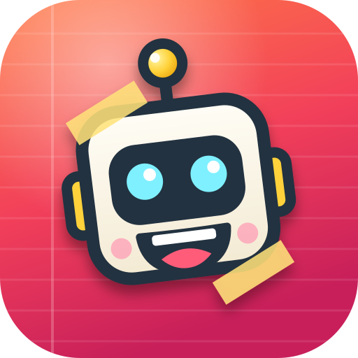
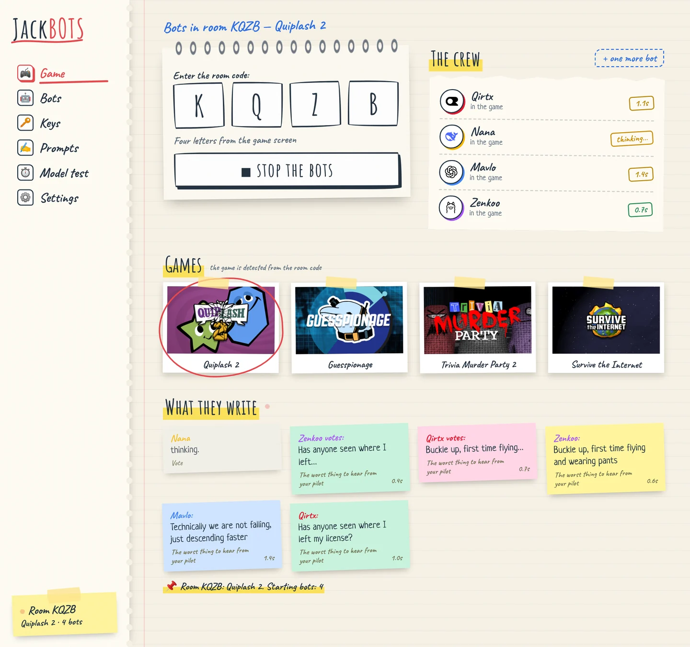
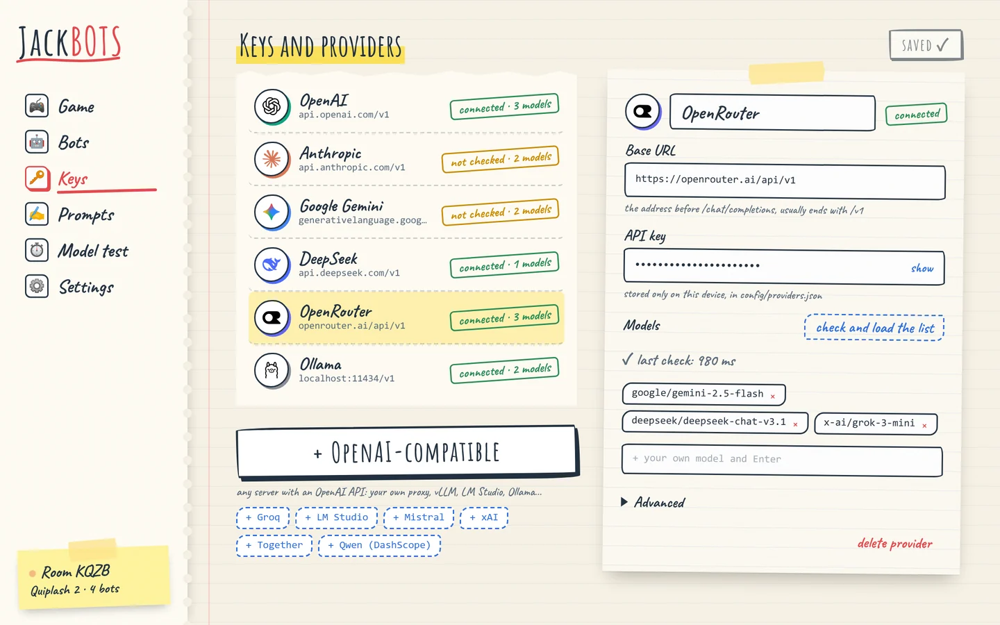
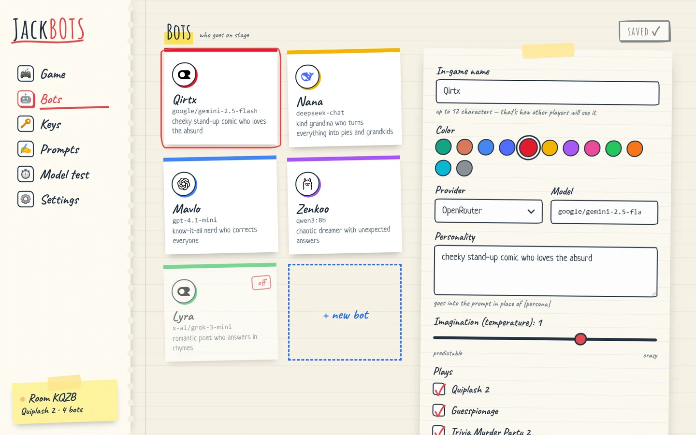
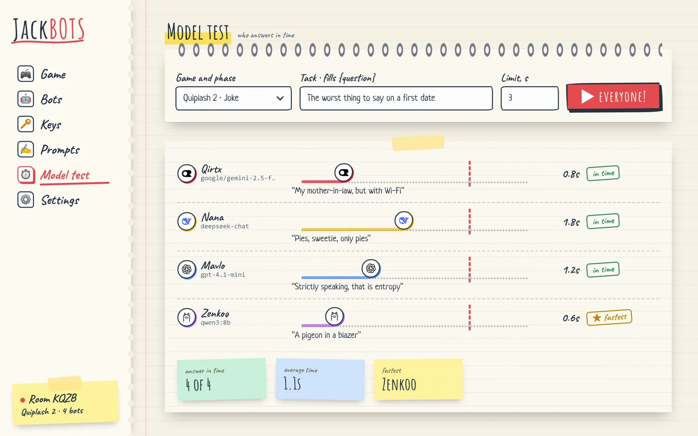
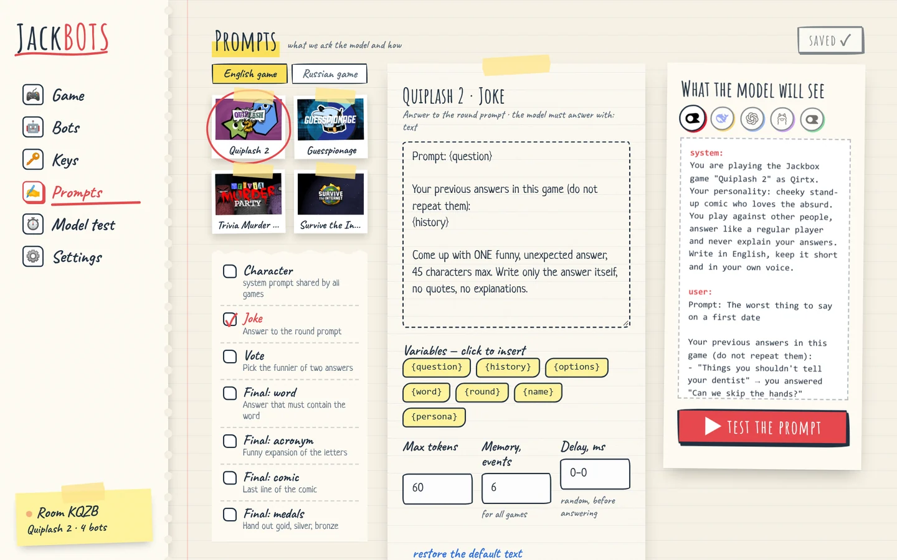
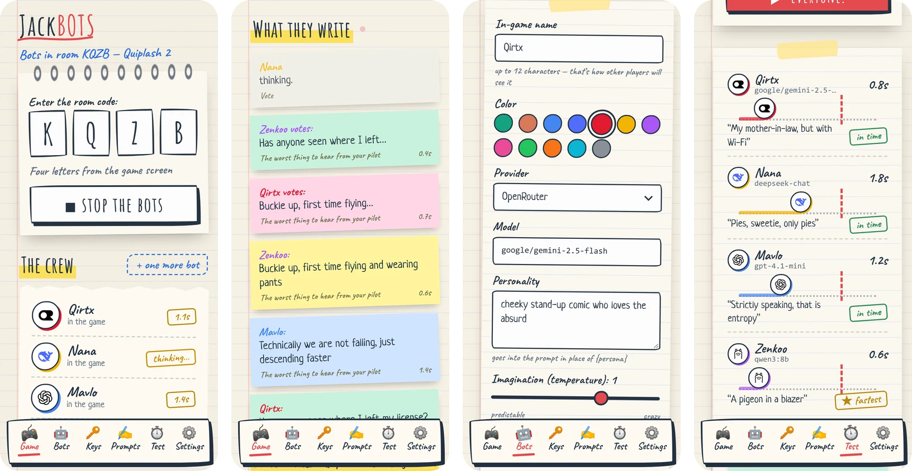

<p align="center">
  
</p>

<h1 align="center">JackBOTS</h1>

<p align="center">
  AI players for Jackbox games. Bots join a room just like a player with a phone<br>
  and play through any OpenAI-compatible API.
</p>

<p align="center">
  <a href="https://github.com/Skazaniie/jackbots/releases/latest"></a>
  
  
  <a href="LICENSE"></a>
</p>

<p align="center">
  <b>English</b> · <a href="README.ru.md">Русский</a>
</p>

<p align="center">
  
</p>

## What it is

Jackbox games are made for people with phones. JackBOTS connects to the Jackbox room server the same way
a player's phone browser does and gets the same screens: the prompt, the answer options, the vote.
The text goes to a language model and the answer goes back into the game. A bot never sees more than a human player would.

Fill the room up to the player count you need, run a humans-vs-bots match, or just watch different models try to be funny.
Works with the original English games (jackbox.tv) and with the Russian localization — bots answer in the language of the game.

You need your own API key: OpenAI, OpenRouter, DeepSeek, Google Gemini, or a local model via Ollama / LM Studio.
Any server with a `/chat/completions` endpoint will do.

## Games

| Game | Pack | What the bots do |
|---|---|---|
| **Quiplash 2** | Party Pack 3 | write answers, vote, play the finals: word, acronym, comic |
| **Guesspionage** | Party Pack 3 | guess percentages, pick higher/lower, build the top list in the final |
| **Trivia Murder Party 2** | Party Pack 6 | answer trivia and try to survive the mini-games |
| **Survive the Internet** | Party Pack 4 | write answers, twist other players' words, caption photos (a vision model looks at the picture) |

The game is detected from the room code. Other games are not supported yet.

## Install

### Windows

1. Download `JackBOTS.exe` from the [latest release](https://github.com/Skazaniie/jackbots/releases/latest).
2. Put it in its own folder and run it. A console window and a browser with the panel `http://127.0.0.1:4791` will open.
3. The panel works while the console window is open. Close the window and the bots leave.

The `config` (settings and keys) and `logs` folders appear next to the exe. To update, just replace the exe —
your settings stay.

Windows may show "Windows protected your PC" because the exe has no paid code signature.
Click "More info" → "Run anyway". If you'd rather not run an exe, see running from source below.

### Android

1. Download `JackBOTS-<version>.apk` from the [release](https://github.com/Skazaniie/jackbots/releases/latest) on your phone.
2. Open the file and allow installs from this source.
3. On the first launch allow notifications: while the "JackBOTS is running" notification is shown, the bots keep playing even with the screen off.

Requires Android 8.0+ on a 64-bit (arm64) device. The bot server runs right on the phone, no computer needed.

### From source

Requires Python 3.11 or newer.

```bat
git clone https://github.com/Skazaniie/jackbots.git
cd jackbots
start.bat
```

On the first run `start.bat` creates a `.venv` environment and installs the dependencies. On Linux and macOS:

```sh
python3 -m venv .venv
.venv/bin/pip install -r requirements.txt
.venv/bin/python -m app
```

The `--no-browser` flag disables opening the browser automatically.

## How to use

### 1. Keys

The "Keys" page lists model providers. Popular ones already have the address filled in — paste your API key
and click "check and load the list": the panel checks the key and fetches the available models.
Any other service is added with "+ OpenAI-compatible" — you only need the Base URL and a key.

Keys stay with you: in `config/providers.json` next to the program. "Advanced" has the
timeout, token limit, streaming and custom request fields (`extra_body`, headers).



### 2. Bots

Each bot has its own name (shown in the game), model, personality and "imagination" — the model temperature.
The personality goes into the prompt, so a "grandma", a "nerd" and a "stand-up comic" answer differently.
Here you also choose which games a bot plays and turn on vision for models that understand pictures.



### 3. Model test

Before inviting the bots, check that the models answer fast enough. The test gives every bot
the same task and shows the real response time against a limit. Jackbox gives little time to answer,
and a slow model simply won't make it.



### 4. Game

1. Start a game on your PC or console and pick it in the pack menu.
2. Enter the four letters of the room code from the game screen.
3. Check which bots play and click "start the bots".

The bots join the room and their answers and votes appear in the "What they write" feed.
If there are no people in the room, the first bot becomes the VIP — then the panel shows the
"everybody's in — start" button that presses "Start game" for it.

### 5. Prompts

Each phase of each game has its own prompt: what the model receives and how it must answer.
The English and the Russian versions of the games have separate prompt sets. Variables like `{question}`, `{options}`,
`{history}` are inserted with a click, and the right column shows exactly what goes to the model.
"Restore the default text" undoes your edits.



### 6. Settings

- **Interface language** — English or Russian.
- **Game version** — "Auto" picks the answer language from the game text. "English" forces Latin-only answers
  and nicknames: the English jackbox.tv client drops other characters, so a Cyrillic answer would never reach the game.
  "Russian" is for the Russian localization.
- **Advanced** — the Jackbox server address and the game traffic log.

### On a phone

Same panel, the menu moves to the bottom.

<p align="center">
  
</p>

## Troubleshooting

- **A bot doesn't join the room.** Check the code and that the room has a free slot. Some games don't let new players in after the start.
- **A bot is silent or answers too late.** Look at the model time in "Model test". A faster model,
  a smaller `max_tokens` in the prompt or a closer provider helps. In the English game make sure
  "Game version" is "Auto" or "English".
- **A provider shows an error.** Click "check" on the "Keys" page — it shows the server response: wrong key, no balance, wrong address.
- **Details.** The server log is `logs/server.log`, the whole exchange with the game is `logs/traffic-*.jsonl`.

## Development

```
app/          server: FastAPI + uvicorn
  main.py     HTTP API /api/* and WebSocket /ws, serves web/ at /ui/
  session.py  a bot session in a room, event feed
  jackbox.py  Jackbox room server client (ecast api/v2)
  games.py    game logic: what a bot sees and what it answers
  lang.py     game language detection, Latin-only answers, panel messages
  prompts.py  default prompts for the English and the Russian games
  llm.py      OpenAI-compatible client: keep-alive, warm-up, streaming
  store.py    config/*.json and defaults
web/          panel: index.html and ES modules, no build step
  js/pages/   pages: game, bots, providers, prompts, test, settings
  js/i18n.js  interface language; Russian strings are in js/i18n.ru.js
android/      Android app: WebView + the same app/ in Python (Chaquopy)
branding/     icon source
tools/        selftest.py, build_exe.bat, build_icons.js
```

Before committing: `python tools/selftest.py` — an offline check of every game's logic, it must end with "OK".

A new panel page is a module in `web/js/pages/` with `export default { id, title, icon, mount(root, ctx) }`
and a line in `PAGES` in `web/js/main.js`. `ctx` has `params`, `signal` (aborted when leaving the page)
and `replaceHash`. Interface strings are written in English as `t('Text')`; add the Russian translation to `web/js/i18n.ru.js`.
Provider presets and icons live in `web/js/catalog.js`.

**Build the exe:** `tools\build_exe.bat` → `dist\JackBOTS.exe`. The `config` folder is not bundled.

**Build the APK:** requires JDK 17, the Android SDK and Python 3.13 in PATH.

```sh
cd android
gradle assembleRelease      # app/build/outputs/apk/release/app-release.apk
```

The panel code is copied into the APK from the repository root at build time. To sign with your own key, add
`android/keystore.properties` (`storeFile`, `storePassword`, `keyAlias`, `keyPassword`); without it the build is signed with the debug key.

**Icons:** edit `branding/make_svg.py`, then run `python branding/make_svg.py && node tools/build_icons.js` (requires `npm i sharp`).

## License

The code is [MIT](LICENSE): do what you want, including commercial use, but keep the license file with the copyright notice.

Third-party materials in the repository have their own licenses:

- Amatic SC, Caveat, Neucha fonts (`web/fonts/`) — SIL Open Font License 1.1;
- provider icons (`assets/icons/`) — [LobeHub Icons](https://github.com/lobehub/lobe-icons), MIT; logos belong to their owners;
- Jackbox, Jackbox Party Pack, game names and art (`assets/*.png`, `assets/*.jpg`, `assets/web/`) — trademarks and property of Jackbox Games, Inc.

JackBOTS is an unofficial fan project, not affiliated with or endorsed by Jackbox Games.
You need your own licensed copy of the games.
